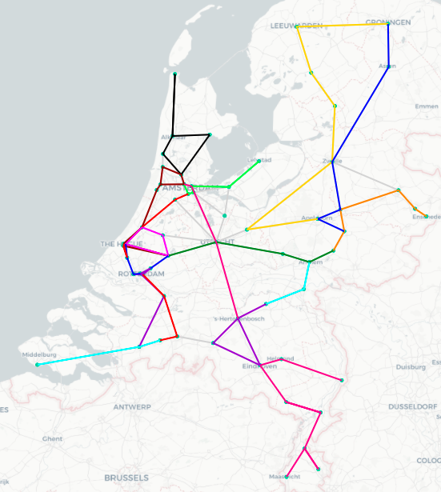
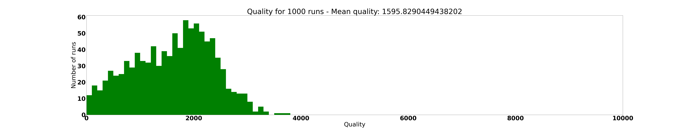
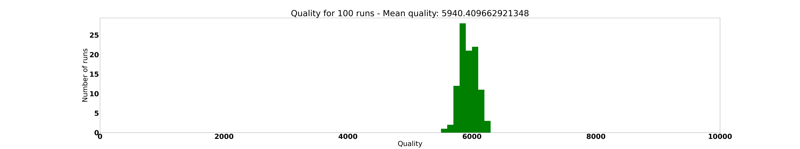
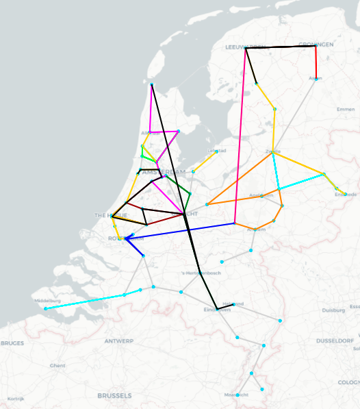

# TeamOntspoord
Project RailNL voor Programmeer Theorie

## RailNL

Voordat een treinnetwerk in gebruik genomen kan worden, is het de bedoeling dat zo efficiënt mogelijk treintrajecten worden uitgestippeld. Daarbij is het van belang dat trajecten niet te kort zijn, waardoor passagiers veel over zouden moeten stappen en er veel treinen in gebruik zijn. Daarnaast kunnen trajecten ook niet te langer dan een maximum tijd duren, en kan er niet teveel spoor onbereden blijven. Om de kwaliteit van de collectie treintrajecten, ook wel de lijnvoering genoemd, te toetsen is gebruik gemaakt van deze formule:

**Kwaliteit = (Aantal bereden connecties / Totaal aantal connecties) * 10.000 - (Aantal trajecten * 100 + tijdsduur in minuten)**

Des te hoger de kwaliteit, des te beter de lijnvoering. Het doel van dit project is om de beste lijnvoering te vinden. Met dit doel hebben wij meerdere algoritmes geschreven. Al deze algoritmes zijn aan te roepen in de commandline via main.py. 

## Gebruikshandleiding

Het eerste wat aangegeven moet worden bij het runnen van `main.py` is welk spoornetwerk gebruikt gaat worden. In de data-map staan vier csv bestanden, waarop respectievelijk de stations en connections voor respectievelijk Holland en heel Nederland staan. In de commandline kan de gebruiker kiezen tussen 'holland' en 'national' om te kiezen tussen deze twee spoornetwerken.

Vervolgens kan de gebruiker kiezen om een algoritme uit te voeren of om een experiment met alle algoritmes uit te voeren met respectievelijk `algorithm` of `experiment`.

Bij de keuze voor een algoritme, moet de keuze gemaakt worden welk algoritme gebruikt gaat worden. Er kan gekozen worden uit `random`, `replace`, `biased_replace`, `greedy`, `depth_first`, `hillclimber`, `annealing` en `reheating`. Deze algoritmes worden onder het kopje 'De algoritmes' in volgorde uitgelegd. Verder moet er gekozen worden of het algoritme 1 keer wordt gerund met `once`, of er een histogram wordt gemaakt met `hist` of dat er voor bepaalde tijd naar de beste lijnvoering wordt gezocht met `best`. Het is ook mogelijk om zowel een histogram te maken als de beste lijnvoering te vinden en te visualiseren met `all`. 

Een voorbeeld van de commandline waarin de hillclimber 1 keer wordt gerund voor de kaart van heel Nederland is: 
```
main.py national algorithm hillclimber once
```



*Het resultaat: Een kaart waarin de routes zijn aangegeven met kleuren. Kwaliteitsscore: 5492.044943820225*

Als er wordt gekozen voor een experiment, kan er een bepaald aantal iteraties gerund worden voor elk algoritme met `iterations` of elk algoritme wordt voor dezelfde tijd gerund met `time`. Daarna moet een integer komen die aangeeft hoeveel iterations of seconden er gebruikt moeten worden.

Een voorbeeld voor een experiment met 100 iterations voor elk algoritme op de kaart van alleen Holland is: 
```
main.py holland experiment iterations 10
```

**TODO plaatje van het experiment**

Hieronder staan twee voorbeelden van histogrammen die gemaakt kunnen worden met `hist`. De histogrammen zijn gemaakt op een schaal van 0 tot 10.000, zodat ze makkelijk met elkaar te vergelijken zijn. De hoeveelheid runs is standaard 100, maar is aan te passen door een hoeveelheid aan te geven in de terminal aan het eind van de commandline. Dit werkt ook voor `all`. 



*Een histogram waarin de kwaliteit van 1000 runs met het random algoritme staan afgebeeld.*



*Een histogram waarin de kwaliteit van 100 runs met het replace algoritme staan afgebeeld.*


### Aanpassingen van het spoornetwerk

De gebruiker kan ook de structuur van de kaart aanpassen! Zo kunnen meerdere willekeurig gekozen connecties verlegd worden. De namen van de verlegde connecties worden geprint. Connecties verleggen kan door --shift in de terminal te typen en het aantal verlegde connecties aan te geven, bijvoorbeeld met 
```
main.py national --shift 3 algorithm random all
```

De gebruiker kan ook een station aangeven dat uitvalt. Dit houdt in dat alle connecties van en naar dit stations komen te vervallen. Als de gebruiker bijvoorbeeld station Amsterdam Centraal wil laten uitvallen kan dit bijvoorbeeld op deze manier:
```
main.py national --fail "Amsterdam Centraal" algorithm random all
``` 

Het is ook mogelijk om verlegde connecties, verwijderde routes en uitgevallen stations terug te stoppen in de kaart. Een voorbeeld van hoe dit werkt staat in `rnet_changes_example.py`. Er is nog één ander optioneel command-line argument in main.py: --optimum. Met --optimum wordt het theoretische optimum van het treinnetwerk na de optionele aanpassingen geprint.



*Kaart waarin Amsterdam Centraal is uitgevallen en drie connecties zijn verlegd.*

## De algoritmes

Het treinnetwerk waar de algoritmes gebruik van maken is opgebouwd uit vier klasses die allemaal staan in het mapje 'classes'. Zo zijn de stations en de connecties tussen de stations aparte klassen, beide staan in `stations_and_connections.py`. De treintrajecten zijn ook een aparte klas, onder de naam 'Train' in `train.py`. Deze drie klasses zijn ondergebracht in de Railnet, in `structure.py`. Elk algoritme maakt gebruik van Railnet om bij de stations, connecties en treintrajecten te komen.

Het eerste algoritme is het random algoritme (`random_algorithm.py`). Hierin wordt een willekeurige hoeveelheid treintrajecten aangemaakt, van 1 tot het maximaal aantal toegestane treintrajecten. Elk treintraject is compleet willekeurig gekozen, met als enige limiet dat het traject niet langer mag zijn dan de maximale tijdsduur. 

Replace (`random_replace.py`) maakt gebruik van het random algoritme, maar vervangt de treintrajecten door betere treintrajecten. Het maximaal aantal toegestane treintrajecten wordt aangemaakt, de treintrajecten zelf zijn wel nog steeds willekeurig gekozen. Vervolgens wordt voor elk treintraject 1000 nieuwe trajecten aangemaakt die het huidige treintraject mogelijk zouden kunnen vervangen. Van al deze treintrajecten wordt de kwaliteit vergeleken en de beste wordt gekozen. Indien het verwijderen van het originele traject de hoogste kwaliteitsscore oplevert, wordt het traject verwijderd. 

Biased replace (`biased_replace.py`) volgt hetzelfde principe als random replace - meerdere treintrajecten worden getoetst en de beste wordt gekozen - maar de trajecten worden niet meer willekeurig bepaald. Elke connectie in het spoornetwerk mag maar één keer gebruikt worden en het traject begint altijd bij een station waar nog één of meer ongebruikte connecties beschikbaar zijn. Een ander verschil is dat er minder nieuwe trajecten worden aangemaakt - voor elk treintraject zijn dat er hier 200. Er is geen betekenisvol verschil zichtbaar bij het eindresultaat voor hogere getallen na 200.

Het greedy algoritme (`greedy_algorithm.py`) maakt gebruik van dezelfde vooringenomen trajecten als biased replace. Connecties worden ook hier maar één keer gebruikt. De verschillen bestaan uit het feit dat het greedy algoritme doorgaat totdat alle connecties bereden zijn, dat de trajecten niet op kwaliteit worden getoetst en bovenal dat het greedy algoritme een constructief algoritme is en met een lege lijnvoering begint.

Het depth-first (`depth_first.py`) algoritme is een variatie op de replace-algoritmes. In plaats van random treinroutes proberen of zelf treinroutes maken, zoekt dit algoritme voor een trein vanaf een bepaald station het beste traject depth-first. Dit betekent dat het algoritme alle mogelijke treinen afgaat en altijd de best mogelijke trein vindt.

Het hillclimber algoritme (`simulated_annealing.py`) maakt steeds kleine veranderingen in een bestaand trajects op zoek naar het beste resultaat. Eerst wordt een lijnvoering gemaakt met het random algoritme, wat vervolgens wordt verbeterd. De trajecten kunnen met één connectie verlengd of verkort worden, in tweeën gesplit worden of er wordt een nieuw traject van één connectie lang gemaakt - zolang het maar de kwaliteit van de lijnvoering ten goede komt.

De simulated annealing en reheating algoritmes zijn extensies van het hillclimber algoritme en staan in hetzelfde bestand (`simulated_annealing.py`). Een groot probleem met een hillclimber algoritme is dat het makkelijk vast komt te zitten in lokale maxima. Dit zijn in dit geval zijn dat kwaliteitsscores die niet met één stap van het hillclimber algoritme verbeterd kunnen worden - ook al is de lijnvoering dan niet het meest efficiënt. Bij deze nieuwe algoritmes worden de stappen van het hillclimber algoritme die de kwaliteit verslechteren tot op zekere hoogte toegelaten. De kans hangt deels af van de temperatuur. Bij simulated annealing begint deze standard bij 20 en daalt langzaam tot 0. Bij reheating begint deze bij 100 en daalt exponentieel tot er lang genoeg geen veranderingen zijn geweest, waardoor de temperatuur zal verdubbelen.
